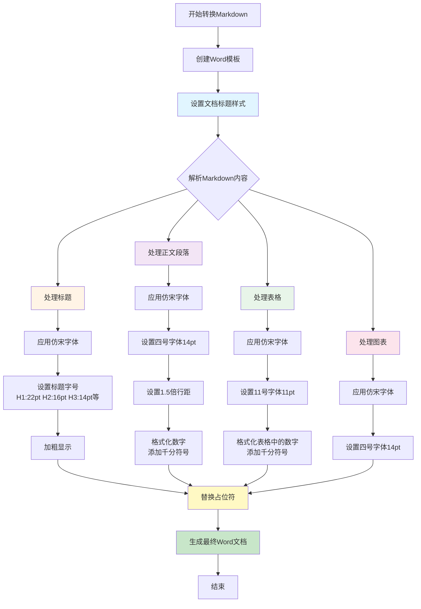

# Word文档格式修改流程图

## 修改内容总结

本次修改完成了以下格式调整：

1. **统一字体**：所有文字统一使用"仿宋"字体
2. **文档标题**：采用"三号字体（16pt），加粗"
3. **正文格式**：采用"四号字体（14pt），1.5倍段落距"
4. **数字格式化**：自动为数字添加千分符号（如：1000 → 1,000）
5. **表格文字**：采用"11号字体（11pt）"

## 代码流程图

## 关键修改点

### 1. 字体统一修改
- **文件**: `template_creator.py`, `word_generator.py`
- **修改**: 所有 `'宋体'` → `'仿宋'`
- **影响范围**: 标题、正文、表格、图表标题

### 2. 文档标题格式
- **位置**: `template_creator.py` 第111行
- **修改**: `Pt(22)` → `Pt(16)` (三号字体)
- **保持**: 加粗样式

### 3. 正文格式
- **位置**: `template_creator.py` 第355行, `word_generator.py` 第157行
- **修改**: `Pt(12)` → `Pt(14)` (四号字体)
- **保持**: 1.5倍行距

### 4. 数字格式化
- **新增函数**: `format_number_with_thousands_separator()`
- **功能**: 自动识别文本中的数字并添加千分符号
- **应用位置**: 
  - 正文段落 (`template_creator.py` 第352行)
  - 文本替换 (`word_generator.py` 第152行)
  - 表格单元格 (`word_generator.py` 第258行, 第551行)

### 5. 表格字体
- **位置**: `word_generator.py` 第252行, 第536行
- **修改**: `'24'` → `'22'` (11pt，11号字体)
- **统一**: 表头和数据行都使用11号字体

## 数字格式化示例

| 原始数字 | 格式化后 |
|---------|---------|
| 1000 | 1,000 |
| 1234567 | 1,234,567 |
| 1234.56 | 1,234.56 |
| 999 | 999 (小于1000不添加) |

## 字体大小对照表

| 字号名称 | 磅值(pt) | 应用位置 |
|---------|---------|---------|
| 三号 | 16 | 文档标题 |
| 四号 | 14 | 正文、图表标题 |
| 11号 | 11 | 表格文字 |

## 注意事项

1. **数字格式化**：函数会自动识别文本中的所有数字（包括整数和小数），并添加千分符号
2. **字体兼容性**：确保系统中安装了"仿宋"字体，否则Word会使用默认字体
3. **段落间距**：正文保持1.5倍行距，符合公文格式要求
4. **表格格式**：表格中的所有文字（包括表头和数据）统一使用11号字体

