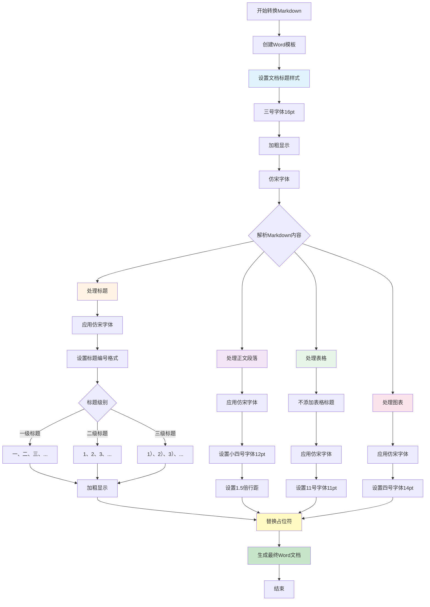

# Word文档格式修改说明（V2）

## 修改内容总结

本次修改完成了以下格式调整：

1. **去掉表格前的占位符**：移除了表格前的"表格 1："占位符
2. **统一字体**：所有文字统一使用"仿宋"字体
3. **文档标题格式**：采用"三号字体（16pt），加粗"
4. **正文格式**：采用"小四号字体（12pt），1.5倍行距"
5. **正文标题编号格式**：从大至小依次采用"一、""1、""1）"

## 代码流程图

## 关键修改点

### 1. 去掉表格前的占位符
- **文件**: `DynamicWordDocumentCreator.java` 第622-629行
- **修改**: 删除了创建表格标题段落的代码
- **效果**: 表格前不再显示"表格 1："等占位符

### 2. 字体统一修改
- **文件**: `DynamicWordDocumentCreator.java`, `PoiWordGenerator.java`
- **修改**: 所有 `"宋体"` → `"仿宋"`
- **影响范围**: 
  - 默认字体常量（第35行）
  - 文档标题（第301行）
  - 各级标题样式（第325-340行）
  - 标题文本（第502行）
  - 图表标题（第574行）
  - 表格单元格（`PoiWordGenerator.java` 第204行）

### 3. 文档标题格式
- **位置**: `DynamicWordDocumentCreator.java` 第300行
- **修改**: `setFontSize(22)` → `setFontSize(16)` (三号字体)
- **保持**: 加粗样式、仿宋字体

### 4. 正文格式
- **位置**: 
  - `template_creator.py` 第418行, `word_generator.py` 第157行
  - `DynamicWordDocumentCreator.java` 第34行（DEFAULT_FONT_SIZE = 12）
- **修改**: `Pt(14)` → `Pt(12)` (小四号字体)
- **保持**: 1.5倍行距、仿宋字体

### 5. 正文标题编号格式
- **位置**: `DynamicWordDocumentCreator.java` 第44-133行
- **新增功能**: 
  - 添加了 `numberToChinese()` 方法，将数字转换为中文数字
  - 修改了 `getNumber()` 方法，根据标题级别返回不同格式
- **编号规则**:
  - 一级标题（H1）：一、二、三、...（中文数字+顿号）
  - 二级标题（H2）：1、2、3、...（阿拉伯数字+顿号）
  - 三级标题（H3）：1）、2）、3）、...（阿拉伯数字+右括号）
  - 四级及以下：使用默认格式（点号分隔）

## Python版本状态

Python版本已经满足所有要求：
- ✅ 表格占位符已去掉（第398行注释：不添加表格标题）
- ✅ 字体统一使用"仿宋"
- ✅ 文档标题使用三号字体（16pt）
- ✅ 标题编号格式已实现"一、""1、""1）"格式

## 字体大小对照表

| 字号名称 | 磅值(pt) | 应用位置 |
|---------|---------|---------|
| 三号 | 16 | 文档标题 |
| 四号 | 14 | 图表标题、图片标题 |
| 小四号 | 12 | 正文段落 |
| 11号 | 11 | 表格文字 |

## 标题编号示例

| Markdown标题 | 生成的Word标题 |
|------------|--------------|
| `# 第一章` | 一、第一章 |
| `## 第一节` | 1、第一节 |
| `### 第一小节` | 1）第一小节 |
| `#### 第一点` | 1.1.1.1 第一点（默认格式） |

## 注意事项

1. **字体兼容性**：确保系统中安装了"仿宋"字体，否则Word会使用默认字体
2. **标题编号**：每个级别的标题独立编号，不显示父级编号
3. **表格格式**：表格前不再显示"表格 X："占位符，直接显示表格内容
4. **文档标题**：文档标题使用三号字体（16pt），加粗显示

## 更新记录

- **2025-01-XX**：完成格式修改V2版本
  - 去掉表格前的占位符
  - 统一使用"仿宋"字体
  - 文档标题采用三号字体（16pt）
  - 正文采用小四号字体（12pt），1.5倍行距
  - 正文标题编号格式：一、1、1）

