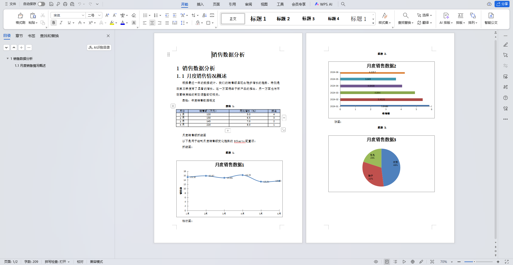

# Markdown 转 Word 文档工具 (md2doc-plus)

项目源于我们开发的一款基于大模型的报告生成工具。由于需要将Markdown格式的内容导出为Word文档，而市面上缺乏合适的现成工具。

## 项目简介

md2doc-plus 是一个基于 Java 17 和 Apache POI 的轻量级 Markdown 转 Word 文档工具。它可以将 Markdown 格式的文档转换为格式化的 Word (.docx) 文档，支持文本、表格和图表等多种内容元素。

## 核心功能

支持完整的 Markdown 语法解析，包括标题、段落、表格和 ECharts 图表，并能将其转换为格式化的 Word 文档。

## 技术架构与实现思路

### 核心组件

1. **Markdown 解析器**
   - 使用正则表达式匹配各种 Markdown 元素
   - [MarkdownToWordConverter](src/main/java/cn/daydayup/dev/md2doc/MarkdownToWordConverter.java) 作为主转换器，协调各组件工作

2. **模板引擎**
   - [DynamicWordDocumentCreator](src/main/java/cn/daydayup/dev/md2doc/template/DynamicWordDocumentCreator.java) 动态创建 Word 模板
   - 根据 Markdown 内容结构生成占位符

3. **内容处理器**
   - [MarkdownTableParser](src/main/java/cn/daydayup/dev/md2doc/parse/MarkdownTableParser.java) 专门处理表格解析
   - [EChartsToWordConverter](src/main/java/cn/daydayup/dev/md2doc/template/EChartsToWordConverter.java) 处理图表转换

4. **文档生成器**
   - [PoiWordGenerator](src/main/java/cn/daydayup/dev/md2doc/generate/PoiWordGenerator.java) 基于 Apache POI 实现 Word 文档生成
   - 替换模板中的占位符并填充实际内容

### 工作流程

1. 读取 Markdown 文件内容
2. 解析 Markdown 内容，识别各种元素（标题、段落、表格、图表等）
3. 根据内容结构动态创建 Word 模板文件
4. 将解析后的内容数据填充到模板中
5. 生成最终的 Word 文档

## 使用方法

### 基本使用

```java
// 转换 Markdown 文件到 Word 文档
MarkdownToWordConverter.convertMarkdownFileToWord(
    "input.md", 
    "output.docx"
);
```

### 测试示例

参考 [Test.java](src/main/java/cn/daydayup/dev/md2doc/Test.java) 文件:

```java
public static void main(String[] args) throws Exception {
    MarkdownToWordConverter.convertMarkdownFileToWord(
        "./markdown/未命名.md",
        "./word/未命名_output.docx"
    );
}
```

## 依赖技术栈

- Java 17
- Apache POI 5.2.2 (Word 文档处理)
- Jackson 2.12.4 (JSON 解析)
- Lombok 1.18.30 (简化 Java 代码)
- Maven 3.8.1 (项目构建)

## 案例效果
原始markdown文件：


转换后的word文档：



## 存在的问题

1. word章节标题样式缺失，无法自动生成目录；
2. 图表样式缺失，图表显示不全，需手动调整；

## 参考
https://github.com/bin-tenkuu/java-DocTemplate