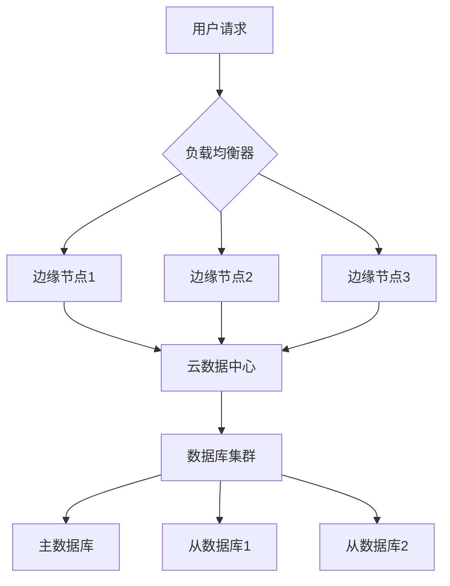
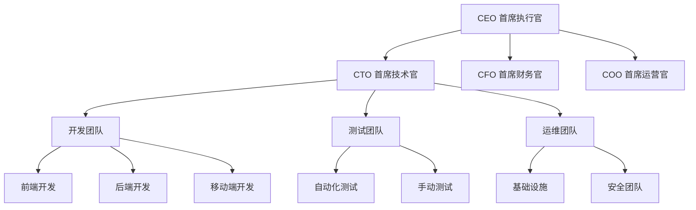
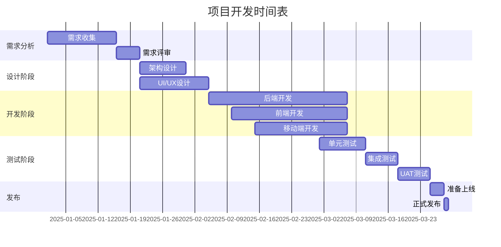
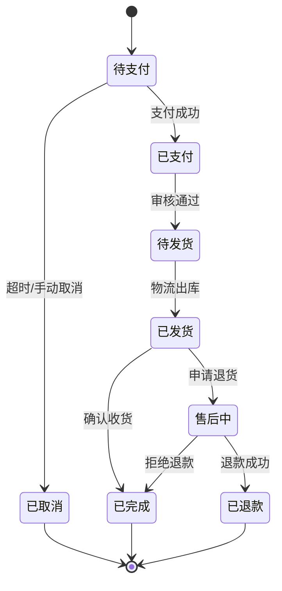
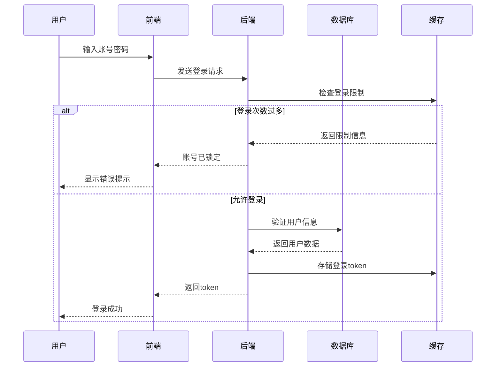
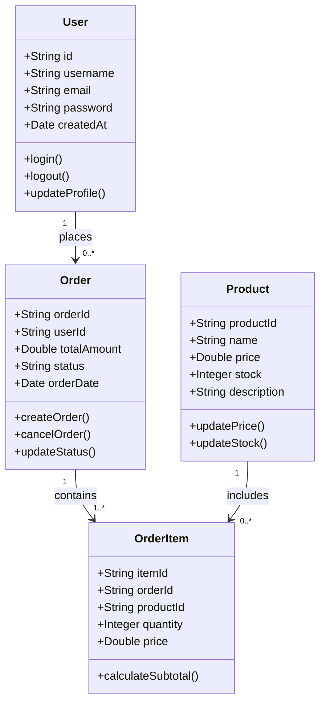
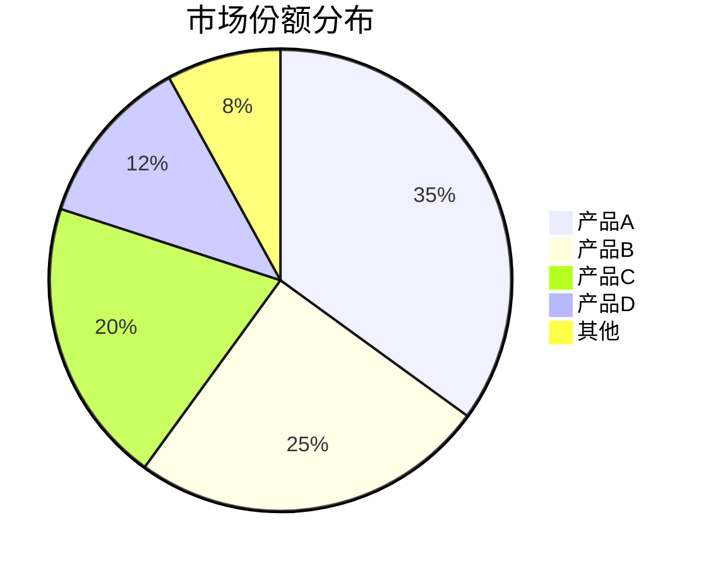
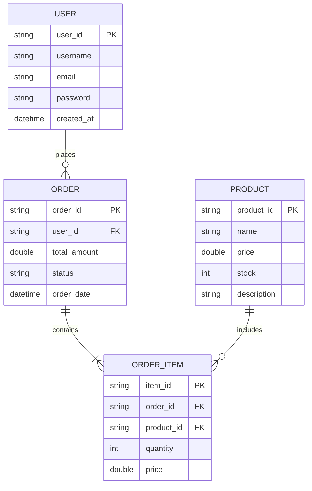
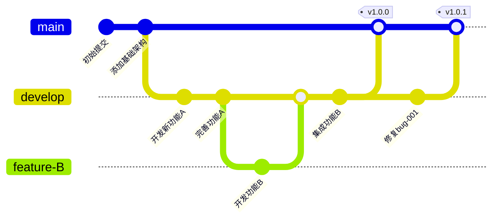

# 项目进度报告

## 执行摘要

本报告展示了项目的当前进展情况,包括流程图、组织结构、甘特图等可视化内容。

## 1. 系统架构流程

以下是系统的主要流程:

## 2. 组织架构

团队组织结构如下:

## 3. 项目时间表

### 3.1 开发阶段甘特图

## 4. 状态机图

系统订单的状态转换:

## 5. 序列图

用户认证流程:

## 6. 类图

系统核心类设计:

## 7. 饼图

市场份额分布:

## 8. 数据统计

### 8.1 月度销售数据

| 月份 | 销售额(万元) | 订单数 | 增长率 |
|------|------------|--------|--------|
| 1月  | 125        | 1,250  | -      |
| 2月  | 138        | 1,380  | +10.4% |
| 3月  | 165        | 1,650  | +19.6% |
| 4月  | 182        | 1,820  | +10.3% |
| 5月  | 195        | 1,950  | +7.1%  |

### 8.2 用户增长数据

| 指标 | Q1 | Q2 | Q3 | Q4 |
|------|----|----|----|----|
| 新增用户 | 15,000 | 18,500 | 22,300 | 26,800 |
| 活跃用户 | 45,000 | 58,200 | 72,600 | 89,100 |
| 留存率 | 68% | 72% | 75% | 78% |

## 9. ER关系图

数据库实体关系:

## 10. Git提交流程

版本控制流程:

## 结论

项目按计划顺利推进,各项指标均达到预期目标。主要成就包括:

1. **技术架构完善**: 建立了稳定的云边协同架构
2. **团队协作高效**: 组织架构清晰,职责明确
3. **项目进度可控**: 按照甘特图有序推进
4. **数据增长良好**: 用户数和销售额稳步增长

下一阶段将重点关注系统性能优化和用户体验提升。

---

**报告人**: 项目经理
**日期**: 2025年10月26日
**版本**: v2.0
