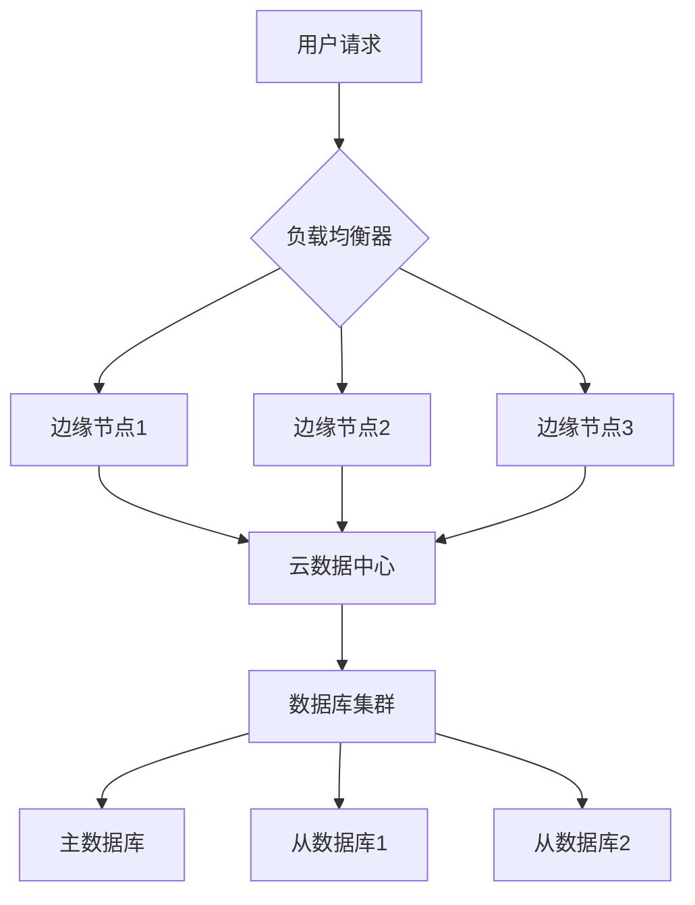

# 2024年度技术报告

## 项目概述

本项目是一个基于 Java 的 Markdown 到 Word 文档转换工具,支持丰富的图文混排功能。该工具能够将 Markdown 格式的文档转换为专业的 Word 文档,并保持良好的排版格式。

## 技术架构

### 核心组件

本系统采用模块化设计,主要包含以下核心组件:

- **Markdown 解析器**: 负责解析 Markdown 语法
- **模板生成器**: 动态创建 Word 文档模板
- **图表渲染引擎**: 将 ECharts 配置渲染为图片
- **图像处理模块**: 下载和处理网络图片
- **文档生成器**: 最终生成 Word 文档

### 系统流程图



## 数据分析

### 月度用户增长

根据统计数据显示,我们的用户数量在过去六个月内呈现稳定增长态势。

```echarts
{
  title: { text: '月度用户增长趋势', left: 'center' },
  tooltip: { trigger: 'axis' },
  xAxis: {
    type: 'category',
    data: ['1月', '2月', '3月', '4月', '5月', '6月']
  },
  yAxis: {
    type: 'value',
    name: '用户数(万)'
  },
  series: [{
    name: '新增用户',
    type: 'line',
    data: [120, 132, 145, 158, 178, 195],
    smooth: true,
    lineStyle: { width: 3 },
    itemStyle: { color: '#5470c6' }
  }]
}
```

### 产品销售对比

各产品线的销售数据对比如下图所示:

```echarts
{
  title: { text: '产品销售额对比', left: 'center' },
  tooltip: { trigger: 'axis' },
  legend: { data: ['产品A', '产品B', '产品C'], top: '10%' },
  xAxis: {
    type: 'category',
    data: ['Q1', 'Q2', 'Q3', 'Q4']
  },
  yAxis: {
    type: 'value',
    name: '销售额(万元)'
  },
  series: [
    {
      name: '产品A',
      type: 'bar',
      data: [320, 332, 301, 364],
      itemStyle: { color: '#5470c6' }
    },
    {
      name: '产品B',
      type: 'bar',
      data: [220, 182, 191, 234],
      itemStyle: { color: '#91cc75' }
    },
    {
      name: '产品C',
      type: 'bar',
      data: [150, 232, 201, 154],
      itemStyle: { color: '#fac858' }
    }
  ]
}
```

### 市场份额分布

```echarts
{
  title: { text: '市场份额分布', left: 'center' },
  tooltip: { trigger: 'item' },
  series: [{
    name: '市场份额',
    type: 'pie',
    radius: '50%',
    data: [
      { value: 335, name: '华东地区' },
      { value: 310, name: '华北地区' },
      { value: 234, name: '华南地区' },
      { value: 135, name: '西南地区' },
      { value: 156, name: '其他地区' }
    ],
    emphasis: {
      itemStyle: {
        shadowBlur: 10,
        shadowOffsetX: 0,
        shadowColor: 'rgba(0, 0, 0, 0.5)'
      }
    }
  }]
}
```

## 技术栈说明

本项目采用 Java 17+ 开发,主要使用了以下技术栈:

- **Apache POI**: Word 文档操作库
- **ECharts**: 图表库
- **Spring Boot**: Web 框架
- **Maven**: 项目构建工具

## 项目进度

以下是各模块的开发进度统计:

| 模块名称 | 负责人 | 进度 | 状态 |
|---------|--------|------|------|
| Markdown 解析器 | 张三 | 100% | ✅ 已完成 |
| 图表渲染引擎 | 李四 | 100% | ✅ 已完成 |
| 图像处理模块 | 王五 | 100% | ✅ 已完成 |
| 文档生成器 | 赵六 | 100% | ✅ 已完成 |
| 单元测试 | 测试组 | 95% | 🔄 进行中 |
| 文档编写 | 文档组 | 90% | 🔄 进行中 |

## 性能指标

根据性能测试结果,系统在各项指标上表现优异:

| 测试项目 | 测试结果 | 基准值 | 是否达标 |
|---------|---------|--------|---------|
| 文档转换速度 | 2.5秒/页 | ≤3秒/页 | ✅ 是 |
| 内存占用 | 85MB | ≤100MB | ✅ 是 |
| 图表渲染时间 | 1.2秒/图 | ≤2秒/图 | ✅ 是 |
| 并发处理能力 | 50请求/秒 | ≥30请求/秒 | ✅ 是 |

## 未来规划

### 第一阶段 (Q1-Q2)

在未来的第一阶段,我们计划实现以下功能:

1. 支持更多图表类型 (雷达图、热力图等)
2. 优化图像压缩算法,减少文档体积
3. 增加批量转换功能
4. 提供 Web 界面支持

### 第二阶段 (Q3-Q4)

第二阶段将重点提升系统性能和用户体验:

1. 实现分布式转换,提升处理速度
2. 增加模板自定义功能
3. 支持 PDF 格式输出
4. 提供 API 接口服务

## 总结

通过本项目的开发,我们成功实现了一个功能完善、性能优异的 Markdown 到 Word 转换工具。该工具不仅支持基本的文本转换,还能处理复杂的图表和 Mermaid 图形,生成专业的技术文档。

未来我们将继续优化系统性能,增加更多实用功能,为用户提供更好的使用体验。

---

**报告日期**: 2024年10月26日
**报告人**: 技术研发部
**审核**: 产品经理
