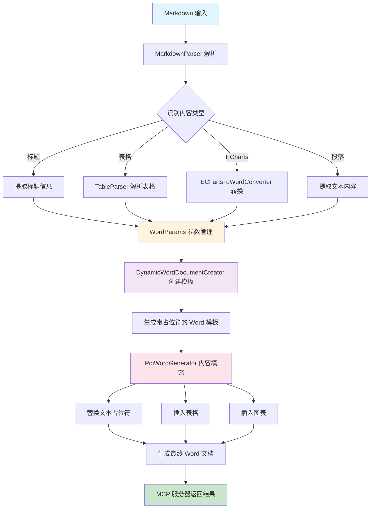
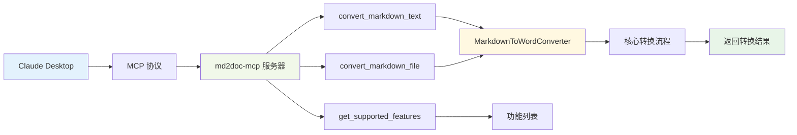
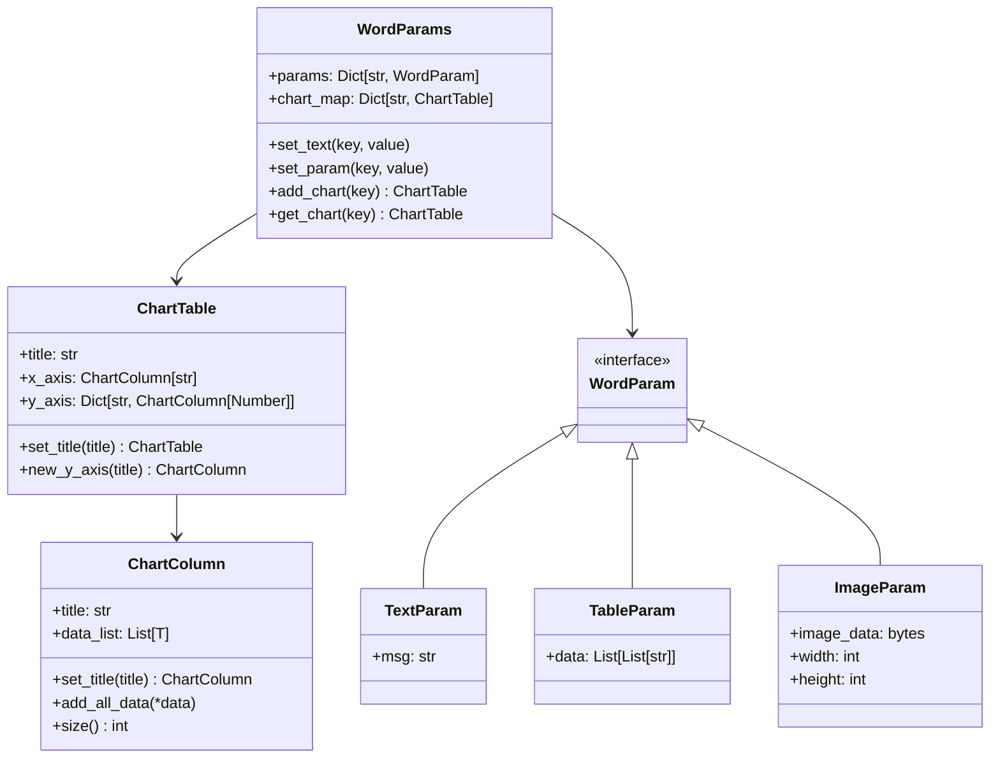
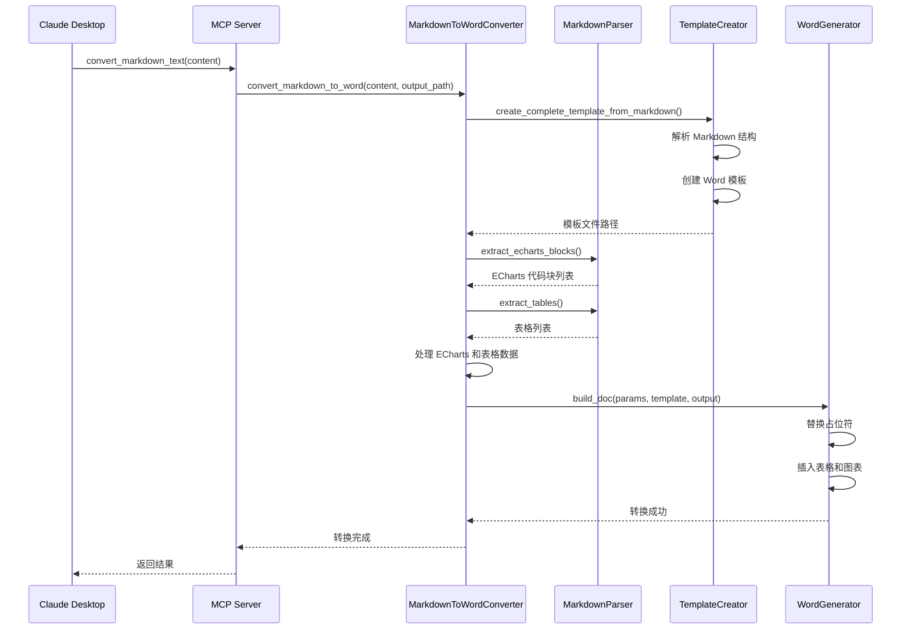

# Markdown 转 Word MCP 服务流程图

## 完整转换流程

```mermaid
graph TD
    A[Markdown 输入] --> B[MarkdownParser 解析]
    B --> C{识别内容类型}
    
    C -->|标题| D[提取标题信息]
    C -->|表格| E[TableParser 解析表格]
    C -->|ECharts| F[EChartsToWordConverter 转换]
    C -->|段落| G[提取文本内容]
    
    D --> H[WordParams 参数管理]
    E --> H
    F --> H
    G --> H
    
    H --> I[DynamicWordDocumentCreator 创建模板]
    I --> J[生成带占位符的 Word 模板]
    
    J --> K[PoiWordGenerator 内容填充]
    K --> L[替换文本占位符]
    K --> M[插入表格]
    K --> N[插入图表]
    
    L --> O[生成最终 Word 文档]
    M --> O
    N --> O
    
    O --> P[MCP 服务器返回结果]
    
    style A fill:#e1f5fe
    style P fill:#c8e6c9
    style H fill:#fff3e0
    style I fill:#f3e5f5
    style K fill:#fce4ec
```

## MCP 服务器架构

```mermaid
graph LR
    A[Claude Desktop] --> B[MCP 协议]
    B --> C[md2doc-mcp 服务器]
    
    C --> D[convert_markdown_text]
    C --> E[convert_markdown_file]
    C --> F[get_supported_features]
    
    D --> G[MarkdownToWordConverter]
    E --> G
    F --> H[功能列表]
    
    G --> I[核心转换流程]
    I --> J[返回转换结果]
    
    style A fill:#e3f2fd
    style C fill:#f1f8e9
    style G fill:#fff8e1
    style J fill:#e8f5e8
```

## 数据模型关系

```mermaid
classDiagram
    class WordParams {
        +params: Dict[str, WordParam]
        +chart_map: Dict[str, ChartTable]
        +set_text(key, value)
        +set_param(key, value)
        +add_chart(key) ChartTable
        +get_chart(key) ChartTable
    }
    
    class ChartTable {
        +title: str
        +x_axis: ChartColumn[str]
        +y_axis: Dict[str, ChartColumn[Number]]
        +set_title(title) ChartTable
        +new_y_axis(title) ChartColumn
    }
    
    class ChartColumn {
        +title: str
        +data_list: List[T]
        +set_title(title) ChartColumn
        +add_all_data(*data)
        +size() int
    }
    
    class WordParam {
        <<interface>>
    }
    
    class TextParam {
        +msg: str
    }
    
    class TableParam {
        +data: List[List[str]]
    }
    
    class ImageParam {
        +image_data: bytes
        +width: int
        +height: int
    }
    
    WordParams --> ChartTable
    WordParams --> WordParam
    ChartTable --> ChartColumn
    WordParam <|-- TextParam
    WordParam <|-- TableParam
    WordParam <|-- ImageParam
```

## 组件交互时序图

```mermaid
sequenceDiagram
    participant Client as Claude Desktop
    participant MCP as MCP Server
    participant Converter as MarkdownToWordConverter
    participant Parser as MarkdownParser
    participant Template as TemplateCreator
    participant Generator as WordGenerator
    
    Client->>MCP: convert_markdown_text(content)
    MCP->>Converter: convert_markdown_to_word(content, output_path)
    
    Converter->>Template: create_complete_template_from_markdown()
    Template->>Template: 解析 Markdown 结构
    Template->>Template: 创建 Word 模板
    Template-->>Converter: 模板文件路径
    
    Converter->>Parser: extract_echarts_blocks()
    Parser-->>Converter: ECharts 代码块列表
    
    Converter->>Parser: extract_tables()
    Parser-->>Converter: 表格列表
    
    Converter->>Converter: 处理 ECharts 和表格数据
    
    Converter->>Generator: build_doc(params, template, output)
    Generator->>Generator: 替换占位符
    Generator->>Generator: 插入表格和图表
    Generator-->>Converter: 转换成功
    
    Converter-->>MCP: 转换完成
    MCP-->>Client: 返回结果
```

