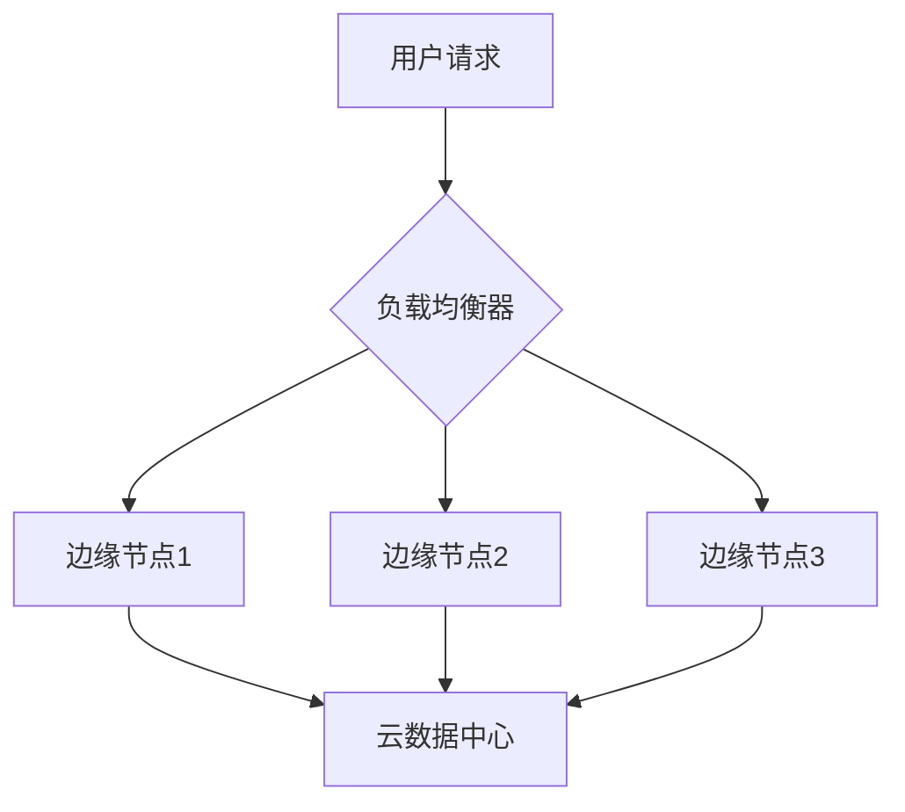
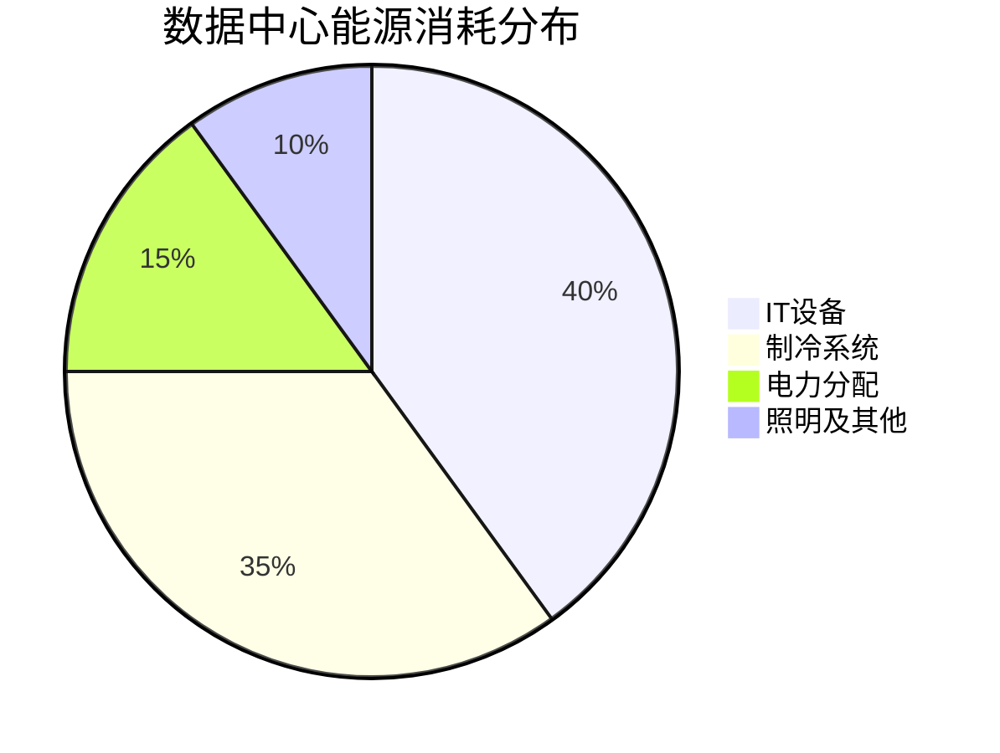

# 2025年技术发展报告

## 执行摘要

本报告概述了2025年最重要的技术发展趋势,包括人工智能、云计算和物联网等领域的最新进展。

## 1. 人工智能领域进展

### 1.1 大语言模型的突破

2025年,大语言模型技术取得了显著进展。主要表现在:

- **更强的推理能力**: 新一代模型在复杂推理任务上表现出色
- **多模态融合**: 文本、图像、音频的无缝整合
- **效率提升**: 模型体积缩小50%,推理速度提升3倍

### 1.2 应用场景扩展

| 应用领域 | 市场规模(亿美元) | 增长率 |
|---------|----------------|--------|
| 医疗诊断 | 150 | 45% |
| 自动驾驶 | 280 | 38% |
| 智能客服 | 95 | 52% |
| 内容创作 | 120 | 67% |

## 2. 云计算架构演进

### 2.1 边缘计算崛起

边缘计算成为云计算的重要补充,主要优势包括:

1. **降低延迟**: 数据处理更接近源头
2. **带宽优化**: 减少数据传输量
3. **隐私保护**: 敏感数据本地处理
4. **成本节约**: 减少云端计算开销

### 2.2 技术架构对比

## 3. 物联网生态系统

### 3.1 设备连接数增长

全球物联网设备连接数持续增长:

- 2023年: 145亿台
- 2024年: 178亿台
- 2025年: 215亿台(预测)

### 3.2 行业分布

物联网设备在各行业的应用分布:

| 行业 | 设备占比 | 主要应用 |
|-----|---------|---------|
| 智能家居 | 32% | 智能音箱、安防系统 |
| 工业制造 | 28% | 设备监控、预测维护 |
| 智慧城市 | 18% | 交通管理、能源优化 |
| 医疗健康 | 12% | 远程监护、健康追踪 |
| 农业 | 10% | 精准灌溉、环境监测 |

## 4. 网络安全挑战

### 4.1 威胁态势

随着技术发展,网络安全面临新的挑战:

- **AI驱动的攻击**: 自动化攻击工具更加智能
- **供应链攻击**: 第三方组件成为薄弱环节
- **量子威胁**: 量子计算对现有加密的潜在威胁
- **深度伪造**: AI生成的虚假内容难以识别

### 4.2 防护措施

推荐的安全防护策略:

1. 实施零信任架构
2. 加强供应链安全审计
3. 部署AI驱动的威胁检测系统
4. 定期进行安全培训和演练
5. 采用后量子加密算法

## 5. 绿色技术趋势

### 5.1 数据中心能效

数据中心能源效率对比:

### 5.2 可再生能源应用

主要科技公司可再生能源使用情况:

- **Google**: 100% 匹配可再生能源
- **Microsoft**: 93% 可再生能源
- **Apple**: 100% 可再生能源
- **Amazon**: 85% 可再生能源

## 6. 未来展望

### 6.1 关键技术趋势

未来三年最值得关注的技术方向:

| 技术领域 | 成熟度 | 影响力 | 投资优先级 |
|---------|--------|--------|-----------|
| 生成式AI | 高 | 极高 | ⭐⭐⭐⭐⭐ |
| 量子计算 | 中 | 高 | ⭐⭐⭐⭐ |
| 6G通信 | 低 | 高 | ⭐⭐⭐ |
| 脑机接口 | 低 | 中 | ⭐⭐⭐ |
| 可持续计算 | 中 | 高 | ⭐⭐⭐⭐ |

### 6.2 战略建议

为了在技术浪潮中保持竞争力,我们建议:

1. **加大AI研发投入**: 重点关注行业特定应用
2. **构建开放生态**: 与合作伙伴共建创新平台
3. **强化人才培养**: 建立持续学习机制
4. **注重可持续性**: 将绿色理念融入技术战略
5. **加强安全防护**: 建立多层次安全体系

## 结论

2025年是技术快速演进的关键年份。人工智能、云计算、物联网等技术的融合创新,正在重塑各行各业。企业需要积极拥抱变化,在技术创新和可持续发展之间找到平衡点,才能在未来竞争中占据有利位置。

---

**报告编制**: 技术研究部
**发布日期**: 2025年10月26日
**版本**: v1.0
