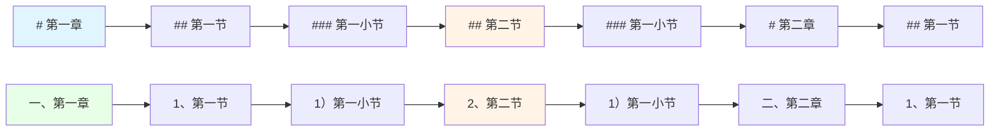

# 标题编号修复流程图

## 修复后的标题编号逻辑流程图

```mermaid
flowchart TD
    Start([开始处理标题]) --> GetLevel[获取当前标题级别 level]
    GetLevel --> CheckLevel{level 与 lastLevel 比较}
    
    CheckLevel -->|level < lastLevel<br/>从子标题跳回父级标题| CheckParent{检查父级标题编号}
    CheckLevel -->|level > lastLevel<br/>进入更深层级| ResetDeeper[重置更深级别的计数器<br/>level+1 到 6]
    CheckLevel -->|level == lastLevel<br/>同级标题| IncrementSame[同级标题继续累加<br/>levelCounters[level]++]
    
    CheckParent --> GetParentNum[获取父级标题编号<br/>parentLevel = level - 1<br/>currentParentNumber = levelCounters[parentLevel]]
    GetParentNum --> GetLastParentNum[获取上次记录的父级编号<br/>lastParentNumber = parentLevels[level]]
    
    GetLastParentNum --> CompareParent{父级编号是否变化?<br/>lastParentNumber != null<br/>且<br/>currentParentNumber != lastParentNumber}
    
    CompareParent -->|是，遇到新的更高层级标题| ResetCurrent[重置当前级别及子级别计数器<br/>level 到 6 都设为 0<br/>levelCounters[level] = 1]
    CompareParent -->|否，还在同一父级标题下| IncrementCurrent[同级标题继续累加<br/>levelCounters[level]++]
    
    ResetDeeper --> SetNewLevel[当前级别从1开始<br/>levelCounters[level] = 1]
    SetNewLevel --> RecordParent1[记录父级标题编号<br/>parentLevels[level] = currentParentNumber]
    
    ResetCurrent --> ResetDeeperLevels[重置更深级别计数器<br/>level+1 到 6]
    IncrementCurrent --> ResetDeeperLevels
    
    ResetDeeperLevels --> UpdateParentRecord[更新父级标题编号记录<br/>parentLevels[level] = currentParentNumber]
    
    IncrementSame --> UpdateLastLevel
    
    UpdateParentRecord --> UpdateLastLevel[更新 lastLevel = level]
    UpdateLastLevel --> End([结束])
    
    style Start fill:#e1f5ff
    style End fill:#e1f5ff
    style CompareParent fill:#fff4e6
    style ResetCurrent fill:#ffe6e6
    style IncrementCurrent fill:#e6ffe6
    style IncrementSame fill:#e6ffe6
```

## 关键修复点说明

### 修复前的问题
```
# 第一章
## 第一节
### 第一小节
## 第二节  ← 错误：被重置为1，应该是2
```

### 修复后的正确行为
```
# 第一章
## 第一节
### 第一小节
## 第二节  ← 正确：继续累加为2
```

### 修复逻辑
1. **记录父级标题编号**：使用`parent_levels`字典记录每个级别的父级标题编号
2. **判断是否遇到新父级**：当从子标题跳回父级标题时，比较当前父级编号与上次记录的父级编号
3. **同级连续编号**：如果父级编号没有变化，说明还在同一个父级标题下，同级标题应该继续累加
4. **新父级重置编号**：只有当遇到新的更高层级标题时，才重置当前级别及其子级别的计数器

## 测试场景流程图



## 代码修改位置

### Python版本
- 文件：`md2doc-service-python/src/md2doc_mcp/core/template_creator.py`
- 类：`HeaderNumbering`
- 方法：`enter_level`
- 关键修改：
  - 添加`parent_levels`属性
  - 修改`level < lastLevel`分支的逻辑

### Java版本
- 文件：`md2doc-core/src/main/java/cn/daydayup/dev/md2doc/core/template/DynamicWordDocumentCreator.java`
- 类：`HeaderNumbering`
- 方法：`enterLevel`
- 关键修改：
  - 添加`parentLevels` Map
  - 修改`level < lastLevel`分支的逻辑

